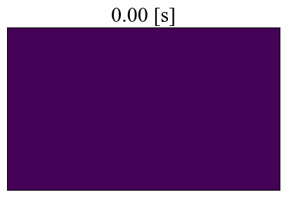

# Thermal Heat Diffusion Simulator Using Implicit Euler

<p align="middle">
    
</p>

A Python simulation framework for modeling **2D heat diffusion** in metallic materials under the influence of **electromagnetic induction** and **Joule heating** effects.
This project numerically solves the coupled equations of thermal and electromagnetic diffusion using finite-difference operators.

> [!NOTE]
> The code was used for my Bachelor project and it is now public after a significant refactoring.

## Overview

This simulator computes the time evolution of the temperature field in a thin metallic plate subjected to alternating electromagnetic potential. It combines:

* **Finite difference discretization** of spatial derivatives.
* **Matrix-based Laplacian and gradient operators** for efficient linear algebra computation.
* **Material-specific physical constants** (conductivity, capacity, etc.).
* **Explicit–implicit integration scheme** for temperature and potential updates.

## Physical Model

The code models the following physical processes:

1. **Electromagnetic potential propagation:** $\mu_0 \frac{\partial V}{\partial t} - \nabla^2 V = \eta J$ where $\mu_0$ is magnetic permeability and $\eta$ is resistivity.

2. **Heat diffusion:** $\frac{\partial T}{\partial t} = \alpha \nabla^2 T + Q_{\text{joule}}$ with thermal diffusivity $\alpha = \frac{k}{\rho c_p}$ and Joule heating $Q_{\text{joule}} \propto |\nabla V|^2$.

The simulation domain is a rectangular `X * Y` plate, discretized into `nx * ny` grid nodes.

## How to Run

First install the dependencies:
```shell
$ pip install numpy tqdm imageio matplotlib
```

Run the main script:

```shell
$ python main.py
```

Then visualize the results:

```shell 
$ python visualization.py
```
